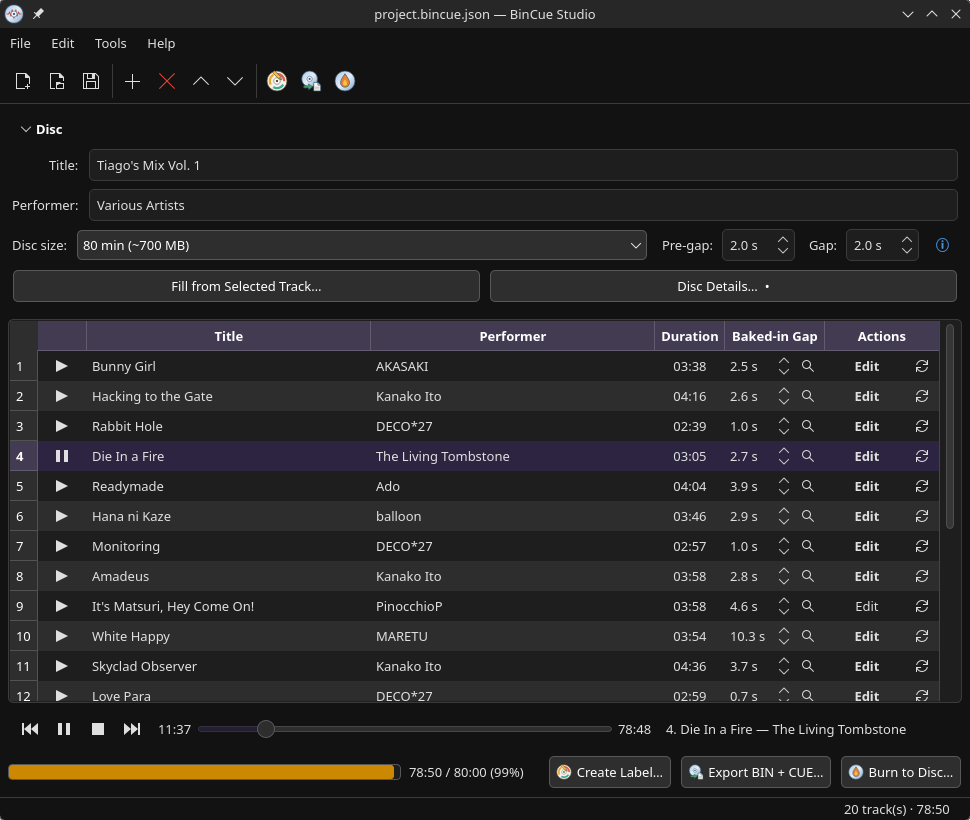
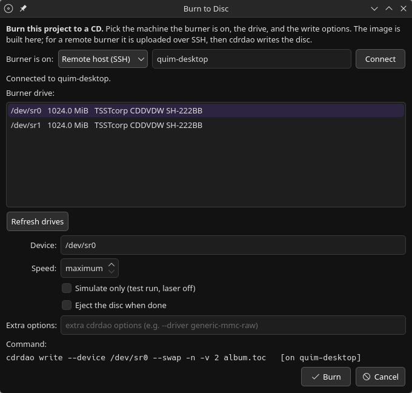
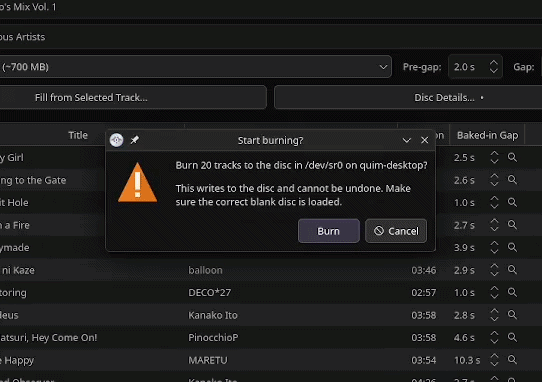
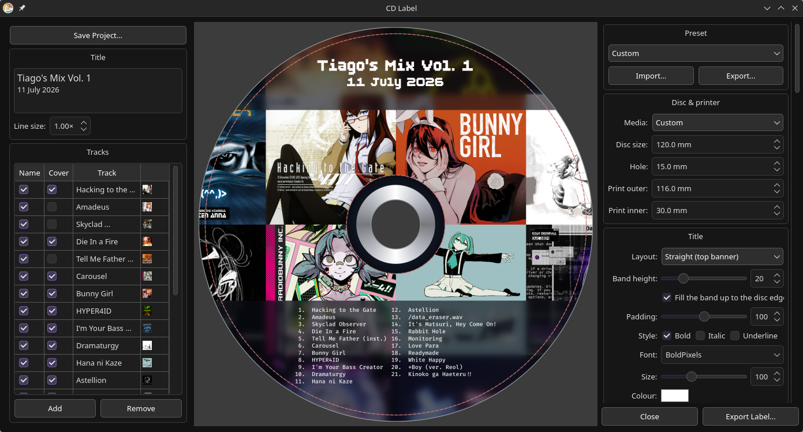
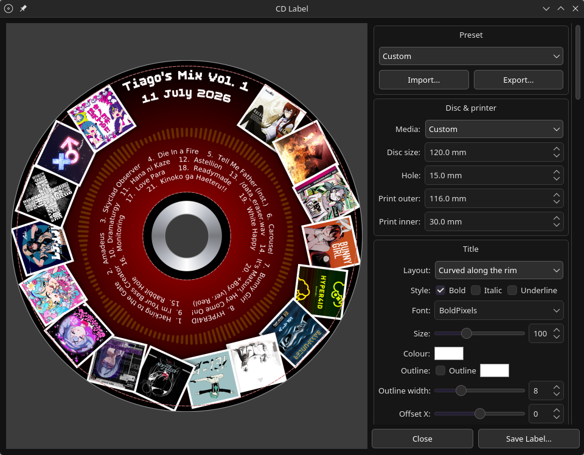

# BinCue Studio

An **Audio CD (CD-DA) project suite** for Linux and Windows: assemble tracks
into a Red Book-correct disc image, design a printable circular label, and burn
to a local or remote CD writer — all from one Qt 6 / C++ application.

Two executables are built by one CMake project:

- **bincue-studio** (`src/`) — the project tool. Builds a single-file CD-DA image
  (BIN + CUE) from FLAC (or any ffmpeg-readable) tracks, with CD-Text metadata,
  Red Book pre-gaps, per-track gap normalisation, a live capacity meter, and
  built-in burning. Projects are saved as `*.bincue.json`.
- **cdlabel** (`cdlabel/`) — the printable CD label editor, launched from
  BinCue Studio (**Create Label…**) or run standalone. See
  [`cdlabel/README.md`](cdlabel/README.md).



## Why another CD program?

Plenty of software burns audio CDs. BinCue Studio exists for a handful of
things that, as far as we can tell, none of them do:

- **Burning to a drive on another machine.** Every burner GUI assumes the
  writer is attached to the computer you're sitting at. Here the burner can be
  a **remote host reached over SSH**: the image is mastered locally, uploaded,
  and written there with `cdrdao`, with the live burn log streamed back. The
  only prior art is CLI plumbing (cdrtools' long-dead `rscsi`, or hand-piping
  images over ssh) — no burning application has offered it as a feature.
  Host setup guide: [`docs/remote-burning.md`](docs/remote-burning.md).
- **Gap reconciliation, not just gap setting.** Most burners let you choose the
  pause appended between tracks; none of them account for silence *already
  baked into* the files. Rips and downloads often carry a second or two of
  trailing silence per track, and appending a fixed pause on top double-counts
  it — the usual advice is "trim it in an audio editor first". In BinCue Studio
  you declare each track's baked-in trailing silence, and export trims or pads
  automatically so every audible gap comes out exactly as asked — no
  hand-editing audio or cue sheets.
- **The disc image as a first-class artifact.** Export produces a Red Book
  CD-DA image — **BIN + CUE + cdrdao TOC**, with CD-Text — that you can keep,
  verify, and burn with any tool, not just this one. On Linux that has always
  meant chaining CLI tools (shntool, cuetools, cdrdao); the GUI burners only
  burn.
- **A label editor that works from the music itself.** Disc-label tools exist,
  but as separate, mostly dormant apps that start from a blank page. cdlabel is
  integrated: it pulls the cover art embedded in your tracks and builds the
  label from it — cover mosaics, feature-cover rings, curved track listings —
  with a live preview and reusable presets.

And all of it in one native Qt 6 / C++ application — pieces (image mastering,
gap control, remote burning, label design) that on Linux have never lived
together in one program. It runs on Windows too: every release ships an
installer with both apps.

## Features

- Drag-and-drop track ordering with per-disc and per-track metadata.
- Automatic tag import (title, performer, songwriter, ISRC, cover art) from the
  source files via TagLib.
- Red Book-aware timing: correct track 1 pre-gap, normalised inter-track gaps,
  and a live capacity meter that turns red when you exceed the disc.
- A built-in **gapless preview player**: hear the whole assembled program —
  every track, with the exact inter-track gaps — streamed on demand straight
  from the source files, so you can audition the disc before burning it.
- One-click **BIN + CUE + cdrdao TOC** export with embedded CD-Text.
- Burn to a local drive, or to a burner on **another machine over SSH** — the
  image is built locally, uploaded, and written with `cdrdao`.
- A full circular **label editor** with live preview, reusable JSON presets,
  and its own label-project format saved beside the CD project.

## The Disc panel, field by field

Most fields are self-explanatory metadata. The ones specific to CD mastering:

| Field | What it does |
|---|---|
| **Catalog (UPC)** | The disc's Media Catalog Number — a 13-digit UPC/EAN barcode. Written as `CATALOG` in the cue sheet; ignored unless it is exactly 13 digits. Optional. |
| **ISRC** (per track) | The 12-character International Standard Recording Code identifying each recording. Auto-filled from the source's tags when present. Optional. |
| **Disc size** | The blank's capacity — **74 min (~650 MB)** or **80 min (~700 MB)** — which sets where the capacity meter tops out. |
| **Pre-gap** | The silent gap (`PREGAP`) before track 1. The Red Book fixes this at **2 s**; other values are off-spec and may not play back reliably (a ⚠ appears if you change it). |
| **Gap between tracks** | The gap every track ends up with (0 after the last). Unlike track 1's pre-gap, this is only a *convention*, not enforced by the Red Book — set it to `0 s` for a gapless album, or trim it to reclaim a few seconds when a disc is just over capacity. |
| **Baked-in Gap** (per track) | Trailing silence a source file *already contains*. On export each track's baked-in gap is trimmed or padded so the real gap matches "Gap between tracks", so pre-existing silence is never double-counted. |
| **Fill from Selected Track…** | Copies album title, performer, songwriter, genre, year and catalog from the selected track's tags into the disc-wide fields. |

(Which track names and covers appear on the *label* is chosen per track in the
label editor itself, not here — the `.bincue.json` project stays purely about
the audio.)

The **capacity meter** at the bottom sums program audio plus every gap and pre-gap
against the chosen disc size, so you always see exactly how much fits.

## Burning

Export produces a `BIN + CUE + TOC` set you can burn with any tool, or use the built-in
**Burn to Disc…** dialog. The burner can be **local** or a **remote host reached
over SSH** — handy when your writer lives on another machine. The image is built
locally, uploaded if remote, and written with `cdrdao` (the exact command is
shown before you commit). Options include write speed, **Simulate only** (a laser-off
test run), eject-when-done, and free-form extra `cdrdao` options.



The live burn log, over SSH:



### Troubleshooting the burn (drive quirks)

BinCue Studio hands `cdrdao` a TOC with a `CD_TEXT` block and lets it drive the
recorder, so the image is rarely the thing at fault. When a burned disc *looks*
wrong, the usual culprit is a **drive quirk on read-back** — the same disc often
behaves differently in another drive. A couple of these look exactly like
software bugs and aren't:

- **CD-Text is on the disc, but a given drive won't read it back.** Writing
  CD-Text and *reading* it back are two separate drive capabilities, and
  read-back is media-dependent on top of that: a drive can write a perfectly good
  CD-Text lead-in to a CD-R and then be **unable to read that same disc's CD-Text
  back**, while reading pressed discs and CD-RW just fine. This really happens —
  in testing, a *TSSTcorp CDDVDW SH-222BB* burned a CD-R with correct CD-Text but
  reported none when reading it back (via both `cdrdao` and `cd-info`); the
  **identical disc showed full CD-Text in a different drive** (an *HL-DT-ST
  DVDRAM GSA-T50N*). The data was there the whole time. So don't conclude the
  burn failed from a single drive's read: `cdrdao read-toc` / `read-cd` often
  can't see lead-in CD-Text at all, `cd-info /dev/sr0` uses the proper command
  but is still at the mercy of the drive, and the real arbiter is **a second
  drive and/or a CD-Text-capable player**. Verify there before re-burning.

- **The write speed you asked for isn't always the one you get.** `--speed` is a
  *request*. The drive negotiates the real speed against the media's rated speed
  (the CD-R's ATIP groove, the CD-RW's rating) and its own firmware's list of
  supported speeds — so it may clamp **down** (ask 16×, a 10× CD-RW burns at 10×)
  or bump **up** to a floor (ask 8×, a CD-R burns at 16× because that media has a
  *minimum* supported write speed and the drive won't go below it — many SATA
  burners bottom out at 16×). If `cd-info` reports `Can set drive speed : No`, the
  drive doesn't implement the MMC `SET CD SPEED` command and will ignore the field
  entirely. It's a cosmetic mismatch between the log and your
  request, not a bincue bug.

The through-line: if audio and ISRC verify but CD-Text (or another lead-in
feature) appears to be missing, suspect the **reader/media combination** first —
confirm what's actually on the disc with `cd-info` and a second drive before
blaming the burn or the image.

## The label editor (cdlabel)

cdlabel builds a printable disc label by **stacking independent layers** — there
are no exclusive "modes". You choose a layout for the title and, separately, one
for the track list; you turn cover art, decoration and background layers on or off
one at a time; and everything composites together. A live preview updates as you
work, and any look you land on saves to a human-editable JSON preset (two are
built in, **Poster** and **Polaroid**).

The label's *content* is edited in a panel on the left: the printed title (each
line individually scalable) and, per track, whether its **name** appears in the
listing, whether its **cover** joins the artwork, and a **rename** — so a track
can stay on the disc but off the label, or vice versa. Content and design
together save as a **label project** (`*.cdlabel.json`) kept beside the CD
project; when you relaunch the editor from BinCue Studio it picks the label
project up again and re-applies your per-track choices to the current track
list, matching tracks by name.

| Poster — straight banner, cover mosaic, bottom track table | Polaroid — curved title, feature-cover ring, arc track list |
|---|---|
|  |  |

Think of the label as a stack drawn from the back forward:

**1. Background & disc geometry.** The disc is fully parametric — outer diameter,
centre-hole diameter, and the printer's printable outer/inner margins — with
presets for common media (a 120 mm inkjet disc, hub-printable discs, 80 mm mini
CDs). Underneath everything you can lay a solid or gradient **backdrop**, or your
own **background image**. Turn on **full bleed** to run the background past the
printable ring to the disc edge (the printer clips it), so there's no white margin.

**2. Cover art**, drawn from the covers embedded in your tracks, in two
independent sub-layers:

- a **background mosaic** — every cover repeated across the disc in a *grid* or
  *spiral*, then washed back (fade, desaturate, blur, tint) so text stays
  readable over it;
- **feature covers** — each distinct cover shown once, crisp and full-colour,
  either as a *ring* around the rim or *scattered* through the middle.

You can reorder covers or drop individual ones by hand, or let an automatic
anti-clumping spread place them for you.

**3. Decoration.** Optional flourishes over the artwork: an **overlay band** (a
feathered translucent ring or horizontal strip), a faint **circular waveform**
seeded by the track names (stable, but unique to each album), a filled or
gradient **hub**, and a **metallic hub ring** hugging the centre hole.

**4. Text — title and track list.** Each picks its own layout:

- **Title** — *curved* along the rim, or a *straight banner* in a band across the
  top. Full control over font, size, bold/italic/underline, colour, an optional
  outline, and free X/Y nudging. The text itself is edited in the content panel
  (multi-line, each line individually scalable).
- **Tracks** — *curved concentric rings*, *two rim-hugging columns*, or a
  *multi-column table* in a bottom band. Optional track numbers, underline, and
  the same font/size/colour/outline controls.

**5. Readability helpers**, so text reads over busy art:

- **Text plates** — a rounded pill behind each individual line of text (an
  arc-shaped pill for curved text).
- **Text panels** — a treatment of the whole zone behind the title and/or the
  tracks: re-blur the mosaic there, fill it solid, or wash it with a tint/fade.

See [`cdlabel/README.md`](cdlabel/README.md) for the exhaustive per-knob reference
and the headless (`--render`) mode for scripting label PNGs without the GUI.

## Install

- **Windows** — grab `BinCueStudio-<version>-Setup.exe` from the
  [Releases page](https://github.com/TheGameratorT/bincue-studio/releases); it
  installs both BinCue Studio and the CD Label Editor and **bundles `cdrdao`
  and the audio-only FFmpeg libraries**, so burning and audio decoding work out
  of the box —
  nothing else to install. (Burning to a drive on another machine over SSH is
  still available if you want it — see [Burning](#burning).)
- **Arch Linux** — build the package in `packaging/aur/` (it links the shared
  [hostkit](https://github.com/TheGameratorT/hostkit) library).
- **From source** — see below.

## Build

```sh
cmake -B build
cmake --build build
```

[hostkit](https://github.com/TheGameratorT/hostkit) must either be checked out
as a sibling directory (`../hostkit`, vendored automatically) or installed as a
package (`-DBINCUE_USE_SYSTEM_HOSTKIT=ON`). For the Windows build and
installer, see [`installer/README.md`](installer/README.md).

Both executables land in `build/bin/`, side by side — that is how bincue-studio
finds cdlabel at runtime (`CDLABEL_BIN` overrides the path; PATH is the fallback).

### Requirements

- **Qt 6** (Core / Gui / Widgets) and **CMake ≥ 3.21** to build.
- **FFmpeg's libav\*** (`libavformat` / `libavcodec` / `libavutil` /
  `libswresample`) — linked directly for audio decoding, not shelled out to.
  On Linux install the system **ffmpeg** package (headers + libraries); the
  Windows build compiles a minimal audio-only FFmpeg from source and bundles it.
- At runtime: **cdrdao** for burning. (The Windows installer bundles it; from
  source, or on Linux, install it yourself.)
- **TagLib ≥ 2.0** is optional at build time — it enables tag import in
  bincue-studio and embedded cover-art extraction in cdlabel. Strongly
  recommended.
